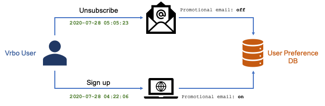
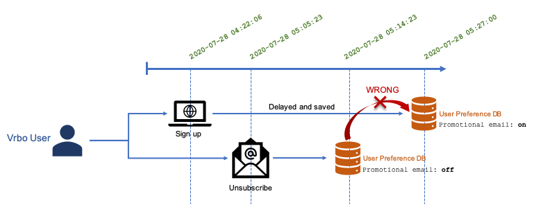
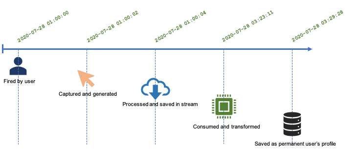
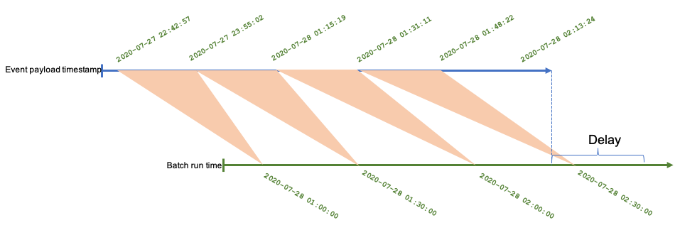
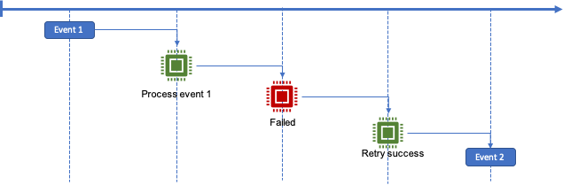
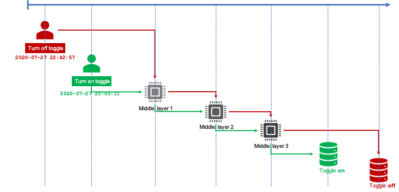
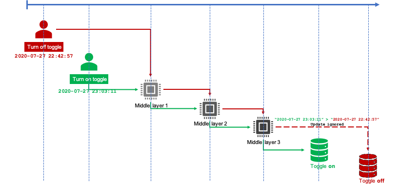

# Be Vigilant about Time Order in Event Based Data Processing

## I. Introduction
Clickstreams, user activities, time-series databases, and much more event-based data technologies nowadays are playing more critical roles in companies' business values. Yet as the data infrastructures built on top of event-based data get more layers and dependencies, honoring the very essential feature of event-based data: time and order becomes harder and often neglected unintentionally. It will expose data inconsistency issues and even legal concerns when the event data represents the users' privacy. In our recent project, this problem showed up and becomes a major issue to solve.

## II. Let's Start with an Example
Our team owns Vrbo's promotional email's data engineering and one of the core data products is the user's email activities: opens, clicks, unsubscribes, spams, bounces, and so on. While other activities are important for analytics and business models, **unsubscribe** events are critical in terms of user's privacy preferences that you don't want to mess up. Also, putting user's email activities aside, a user's certain types of web activities can also trigger his/her **automatic subscribe** action to our promotional emails: booking requests, account sign ups, etc. While in our real world project is more complex, those behaviors can be illustrated like this:



Events come from different places, different channels, and have different delays. They carry different timestamps and values. If not processed carefully, this eventually will act against users' will on their privacy settings. In the scenario shown below, it will cause the user to have the opposite setting on his/her email preference setting:



This is only one example of showing the potential risk when processing event data coming from different channels. What if:

- In a single stream event processing system, the order of events can't be guaranteed?
- Events processing is failed then retried?
- Timestamp doesn't mean what you think it does?
- Batch VS. stream, what are the caveats and advantages?

To discuss those different scenarios, let's step back and start with the basics.

## III. Basics

### 3.1 Timestamp

Timestamp is the foundation of everything here. Without the reference of timestamps, you lose the truth of an event. But what are the different timestamp types? Are timestamps what you thought they are in your data pipelines upstream/downstream contracts? You will definitely see lots of similar fields called:

- createdAt
- updatedAt
- requestedTimestamp
- timestamp
- updateDate
- createDate
- event.header.time
- body.timestamp
- dateid
- hourid
- ...

Ambiguity should be removed and strong definitions should be in place. The entire timeline of an event can be illustrated like this:



While this diagram looks straightforward and streamlined, in the real world, each of these actions is executed in **different systems, using different technologies, with different schedules, and maintained by different teams**. 

Timestamp definitions vary under each of these steps above. For instance, updatedAt in "Processed and saved in stream" step can mean the timestamp when this event is saved to stream storage, and event.header.time in "Consumed and transformed" step means the timestamp when it's "Fired by user". 

By the time it's permanently saved into the final stage, the most important payload of all: **timestamp when captured and generated**, is probably ignored and lost forever during this long relay. Imagine any of these steps failed to keep the events in order for a single user, the final destination of those events will suffer the consequence.

### 3.2 Batch, Stream

When processing events, two different approaches come into play: batch and stream. They treat the event timestamp in different ways.

#### 3.2.1 Batch

For batching based event processing:

- Because of its timed scheduling, events will be grouped together to process
- **Time watermark** is important to remember the last event it already processed
- When one batch is failed, the entire batch needs to be retried. Batched retry will inevitably result in **sending duplicate events** to downstream consumers unless there's a cache or staged logging implementation that remembers the entire transaction for every batch
- Event order can be kept by **sorting** data by timestamp in each batch, then send to downstream in sequence
- If an event with earlier timestamp arrived after the batch where it should've been processed, this event will be lost forever



#### 3.2.2 Stream

Stream processing tries to process events in real time:

- Event processing order is the same as event arrival time
- Retry won't cause duplicate events issue
- If event arrival time is different than the actual event timestamp payload, the event processing will be out of order unless a local buffer or a mini batch is implemented to preserve a series of events and sort them in the correct order



## 4. The Real Problem and Possible Solution

Despite the simplified data processing model introduced above, the eventual event order problem hasn't be solved. Recall the email preference example we talked above, if the event arrives with wrong order to its final destination database, data updates will be wrong:



To solve this problem, it is critical to **carry the earliest user fired event timestamp from beginning to end**. At the end of the path, before updating the database, we need to check the timestamp to ensure that the event being processed is older than what's recorded in the database. In the final stage, we can implement a timestamp check like this:

```java
boolean updateValue(Event event) {
    long userInitiatedTimestamp = event.getUserInitiatedTimestamp();
    String userId = event.getUserId();
    User user = database.query(userId);
    long lastUserInitiatedTimestamp = user.getLastUserInitiatedTimestamp();
     
    // event arrives in correct order
    if(userInitiatedTimestamp > lastUserInitiatedTimestamp) {
        // register with latest timestamp
        user.setLastUserInitiatedTimestamp(userInitiatedTimestamp);
        user.setValue(event.getPayloadValue());
        return true;
    }
    else {
        // ignored
        return false;
    }
}
```



## 5. Summary

Clickstreams, user activities are at the center stage of our data product lines yet when it comes to detailed event data processing, handling of timestamps and event orders is not treated as good as it should be. Different definitions of timestamps, batching vs. streaming processing and technology choices all made this problem more complex to solve.

The drawback of this solution is that it is hard to implement when there are many middle layers and data products involved in between. The original timestamp is very easily lost if even one step from this pipeline fails to relay the payload. **It needs precise coordination between teams, clear data product definitions, a well-unified data architecture, and ultimate respect for our customers' data**.