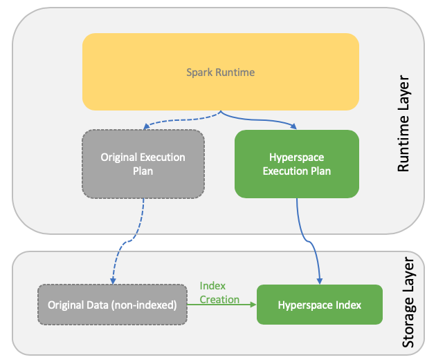

# Hyperspace - Say **YES** to Indexing on DataFrame
Often times, people will be frastratued by the fact that modern Data Lake built on top of Spark and columnar stores isn't so performant when it comes to ad-hoc look up queries, ranges or even joins. Because of data lake's OLAP-oriented nature. What if I can create indexes just like a traditional database that support ad-hoc queries? Well the answer for that is [Hyperspace by Microsoft](https://microsoft.github.io/hyperspace/), an indexing subsystem on top of Apache Spark.

## What is Hyperspace
Hyperspace is a **simple set of APIs** in Spark programming model, to let you easily create and manage indexes on your existing `DataFrame`, and inject its faster execution into Spark's original execution plan to fully utilize the performance boost provided by indexes. 

Overall, its relationship with Spark can be illustrated like this:



## Let's Run a Demo

Currently, Hyperspace support Apache Spark 2.4, with Scala version of 2.11 and 2.12. In this demo, I will use Spark `2.4.6`, with Scala version of `2.11.12` (Java `1.8.0_222`). 

### 1. Set Up Everything in Local

Because Hyperspace is not really production ready and has some limitations, it now only support HDFS based index creation. Therefore, when we run it in local environment, an `localhost:9000` HDFS is needed so that Hyperspace can function properly.

#### 1.1 Download and run a local HDFS

Go to official Hadoop [download page](https://www.apache.org/dyn/closer.cgi/hadoop/common/hadoop-2.9.2/hadoop-2.9.2.tar.gz) and download Hadoop `2.9.2`. Extract the tar ball in your preferred location. Out of box, edit file `$HADOOP_HOME/etc/hadoop/hdfs-site.xml` and make the file look like this:

```xml
<configuration>
<property>
        <name>dfs.replication</name>
        <value>1</value>
    </property>
</configuration>
```

Edit `$HADOOP_HOME/etc/hadoop/core-site.xml` to be like this:

```xml
<configuration>
    <property>
        <name>fs.defaultFS</name>
        <value>hdfs://localhost:9000</value>
    </property>
</configuration>
```

Then in `$HADOOP_HOME/bin` directory, run `./hdfs namenode -format` to format your HDFS for the first time before use.

Go to `$HADOOP_HOME/sbin` directory and execute `start-dfs.sh`. When prompted with SSH questions, make sure that you have all the permissions and SSH keys set up in order to allow Hadoop to SSH into your local machine to act like a pseudo distributed HDFS. As a result, there should be 3 Java processes running acting as `NameNode`, `DataNode` and `SecondaryNameNode` respectively.

Then you are all set for your local HDFS!

#### 1.2 Create a CSV sample file

Create a CSV file like this:
```csv
id,name,zip
1,john smith,78750
2,john doe,78758
3,mike tyson,91731
4,mingwei li,78750
```

and put it into your local HDFS by running:

```shell
$HADOOP_HOME/bin/hdfs dfs -put /path/to/csv/file.csv /hyperspace_test
```

where `/hyperspace_test` is the destination directory in HDFS.

### 2. Run and Test Hyperspace

#### 2.1 Start your Spark shell

To include Hyperspace as a dependency, run 

```shell
$SPARK_HOME/bin/spark-shell --packages=com.microsoft.hyperspace:hyperspace-core_2.11:0.1.0
```

> **NOTE**: Please choose different versions and packages if you are running with different Scala version (`2.11` or `2.12`).

#### 2.2 Load data, create index

To load data, run:

```scala
val df = spark.read.format("csv").option("header", "true").option("inferSchema", "true").load("hdfs://localhost:9000/hyperspace_test/customers.csv")
df.show()
```

Import Hyperspace into spark shell:

```scala
import com.microsoft.hyperspace._
import com.microsoft.hyperspace.index._
```

Next, we want to create an index on column `id`, with included data column of `name`, so that `name` column can be retrieved very fast as well, beneficial from index of `id`:

```scala
val hs = new Hyperspace(spark)
hs.createIndex(df, IndexConfig("index", indexedColumns = Seq("id"), includedColumns = Seq("name")))
hs.indexes.show()
```

This will create an index on the column `id`, and show index information like this:

```
+-----+--------------+---------------+----------+--------------------+--------------------+--------------------+------+
| name|indexedColumns|includedColumns|numBuckets|              schema|       indexLocation|           queryPlan| state|
+-----+--------------+---------------+----------+--------------------+--------------------+--------------------+------+
|index|          [id]|         [name]|       200|{"type":"struct",...|file:/Users/mingw...|Relation[id#10,na...|ACTIVE|
+-----+--------------+---------------+----------+--------------------+--------------------+--------------------+------+
```

Next, let's finally take the advantage of the index that we just created and see how it can change its execution plan and boost up performance.

Write the query like you normally would:

```scala
val query = df.filter(df("id") === 1).select("name")
```

Use Hyperspace to explain how this query will be interpreted by Hyperspace instead:

```scala
hs.explain(query, verbose = true)
```

which will generate output like:

```
=============================================================
Plan with indexes:
=============================================================
Project [name#11]
+- Filter (isnotnull(id#10) && (id#10 = 1))
   <----+- FileScan parquet [id#10,name#11] Batched: true, Format: Parquet, Location: InMemoryFileIndex[file:/Users/mingwli/Dev/lib/hadoop-2.9.2/bin/spark-warehouse/indexes/index/v__=0], PartitionFilters: [], PushedFilters: [IsNotNull(id), EqualTo(id,1)], ReadSchema: struct<id:int,name:string>---->

=============================================================
Plan without indexes:
=============================================================
Project [name#11]
+- Filter (isnotnull(id#10) && (id#10 = 1))
   <----+- FileScan csv [id#10,name#11] Batched: false, Format: CSV, Location: InMemoryFileIndex[hdfs://localhost:9000/mingwli/customers.csv], PartitionFilters: [], PushedFilters: [IsNotNull(id), EqualTo(id,1)], ReadSchema: struct<id:int,name:string>---->

=============================================================
Indexes used:
=============================================================
index:file:/Users/mingwli/Dev/lib/hadoop-2.9.2/bin/spark-warehouse/indexes/index/v__=0

=============================================================
Physical operator stats:
=============================================================
+-----------------+-------------------+------------------+----------+
|Physical Operator|Hyperspace Disabled|Hyperspace Enabled|Difference|
+-----------------+-------------------+------------------+----------+
|        *Scan csv|                  1|                 0|        -1|
|    *Scan parquet|                  0|                 1|         1|
|           Filter|                  1|                 1|         0|
|          Project|                  1|                 1|         0|
|WholeStageCodegen|                  1|                 1|         0|
+-----------------+-------------------+------------------+----------+
```

Where you can clearly see that with Hyperspace, `FileScan` will read **index Parquet file** instead of the original CSV file from HDFS. Although this small example isn't complex enough to show the big advantage from it, it is obvious that building index from original CSV file and save it into **sorted and managed Parquet file** base off `id` column will **bypass shuffle phase**, and therefore increase the performance dramatically.

Finally, let's enable `hyperspace` and execute the query:

```scala
spark.enableHyperspace
query.show()
```

Let's run `query.explain()` to see what's executed under the hood:

```scala
== Physical Plan ==
*(1) Project [name#11]
+- *(1) Filter (isnotnull(id#10) && (id#10 = 1))
   +- *(1) FileScan parquet [id#10,name#11] Batched: true, Format: Parquet, Location: InMemoryFileIndex[file:/Users/mingwli/Dev/lib/hadoop-2.9.2/bin/spark-warehouse/indexes/index/v__=0], PartitionFilters: [], PushedFilters: [IsNotNull(id), EqualTo(id,1)], ReadSchema: struct<id:int,name:string>
```

Physical plan is rewired by Hyperspace. During the pysical plan execution, index created is being scanned instead. Compared the original CSV, index parquet file is pre sorted by column `id` by Hyperspace. Therefore, lookup query like `WHERE id = 123` is faster during execution by hitting the index directly.

Besides this core API functionality, Hyperspace also include index management APIs like:

```scala
hs.refreshIndex("index1")
hs.deleteIndex("index1")
hs.restoreIndex("index1")
hs.deleteIndex("index2")
hs.vacuumIndex("index2")
```

### 3. When to use Hyperspace

If you often has queries that 
- Look up a spcific value (`WHERE col = 'abcd'`)
- Narrow the data into a very small range (`WHERE num > 4 AND num < 7`)
- Or do joins between 2 tables against the common column (`JOIN table2 ON table1.value = table2.value`), you can definitely create indexes on top of those needed columns to speed up your queries

### 4. Summary
That's it for Hyperspace. It builds indexes for your specified columns, to bypass distributed shuffle sort phase during runtime, and therefore boost your query performance. It is still in development stage, so please **use it with caution** in your production deployment. 

---
[Mingwei's blog - Deep Dive on Big Data Technologies](../README.md)