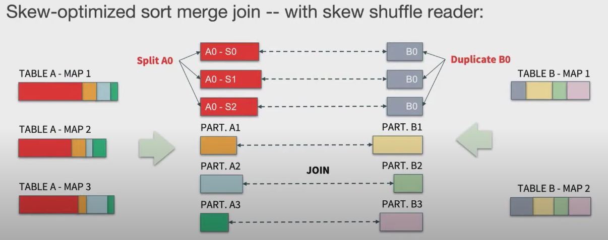

# What's New in Spark 3.0 - Performance

## Introduction

Upon the Spark + AI Summit 2020, Spark 3.0 is introduced to the tech communities with plenty of new features and improvements. Spark core performance improvement, Delta lake updates, better machine learning capabilities, and so much more. This article will mainly focus on its very essential performance updates.


## Adaptive Query Execution

As we know, Spark SQL will be parsed and translated into the query execution **logical plan** and further down to **physical plan**, to be distributed and executed through Spark's very core data structure: RDD. While writing relational queries following general ANSI SQL syntax you are familiar with is convenient, parse those queries by Spark for performant execution is challenging often times. Execution plans are often not optimized given complex filters and joins, imperfect data storage, and many other factors. So that's why Spark 3.0 introduces **Adaptive Query Execution**:


### 1. Convert to Broadcast Hash Join

What is broadcast hash join anyway? When you run a query to join two table like this:

```sql
SELECT a.id, b.name
FROM a
JOIN b ON a.brand = b.brand
```

A universal plan for Spark is to scan entire data table `a` and table `b` respectively, then do a distributed **sort merge** phase based on join key: `brand`. When data table `a` and `b` are both very large, it makes sense to do the joining distributedly. But, if one of the table serves as a dimension table with only limited number of rows, sort merge is an overkill.

Before Spark 3.0, you can set `spark.sql.autoBroadcastJoinThreshold` or use join hint `spark.table("src").join(spark.table("records").hint("broadcast"), "key").show()` to tell Spark treat a join as memory hash join instead of expensive distributed sort merge. 

But it is still not optimal solution: global configuration can't be fit into every query at runtime, and hint is not intelligent. Determining the hash join threshold is difficult because:
1. Underlining file format is missing stats to hint the size of data
2. Data is often compressed or stored in columnar format like Parquet
3. Filters, queries and customized UDFs are complex to be analyzed beforehand
Adaptive Query Execution in Spark 3.0 provides a way to detect the feasibility of hash joining a dataset at runtime based on statistics of finished plan nodes: 

Adaptive Query Execution in Spark 3.0 provides a way to detect the feasibility of hash joining a dataset at runtime based on statistics of finished plan nodes:


This performance gain will be **perfect** if we have data processing scenario like joining a huge fact table with a memory-fitting size of dimension table like this:

```sql
SELECT user.first_name, user.email_address, brand.brand_url
FROM user
JOIN brand ON user.brandid = brand.brandid
```

### 2. Dynamic Shuffle Repartitioning

One of most magical performance tuning number is number of partitions. It controls the level of reducers towards the end of Spark execution and controls the level of parallelism, which greatly affects the overall performance of your Spark applications. But it is hard to tune by only setting this global config of: `spark.sql.shuffle.partitions=200`. 

By only changing this global config, it is hard to fit all different Spark application scenarios. Make it too large, large number of partitions will create small fractional operations against I/O, and put pressure on scheduling. Make it too small, it won't utilize the full potential of distribution and parallelism, and also will cause disk spilling and high GC pressure. 

So in Spark 3.0, **automatic coalesce at runtime** is introduced to solve this problem dynamically: initially, Spark will run the execution with a fairly large partition to accommodate large size of data size to be processed. After its execution, adaptive query execution will adjust based on runtime stats and coalesce the partition into a smaller number if it's needed:


### 3. Data Skew Optimization

When data is skewed, especially when some key partitions are extremely larger than rest of the average size, it will cause:
- Wasted idling resources
- Long tail running process that slows down entire execution
- Out of memory error because of skewed data size

At Spark 3.0, adaptive execution plan will automatically detect skew data by size of its partition, and futher partition it into **smaller sub partition**, triggered by SkewReader:




## Dynamic Partition Pruning

Similar to the optimization done in broadcast hash join, dynamic partition pruning is best suited in the scenario where a big fact table join a memory-fitting small dimension table. During the join query execution, instead of scanning entire dataset of fact table, filtering partitions by the join conditions in advance can cut off unnecessary disk read operations dramatically. This is the perfect application of **filter pushdown** principle.

> **What is Filter Pushdown**: In big data world, popular execution engines like Apache Spark and Apache Drill will try to eliminate whole table scanning as much as possible by applying for data filtering before the scanning operations, thus push down the filter to early stage of query execution. A perfect example will be applying where clause on physical partition keys

---

In Spark 3.0, Conceptually, dynamic partition pruning will change SQL like this (where par_key is the partition key of fact table):

```sql
SELECT fact.value1
FROM fact
JOIN dimension ON fact.par_key = dimension.par_key AND dimension.range < 3
```

into this:

```sql
SELECT fact.value1
FROM fact
WHERE fact.par_key in (
    SELECT par_key
    FROM dimension
    WHERE range < 3
)
```

The idea is to use dimension table's filter to cut off unnecessary full table scan against big fact table by dynamically updating the execution plan and determine the **partition pruning**, if the join key happens to be partition key of fact table:


## Merge Joins

Like it's mentioned above, you can [hint Spark](https://spark.apache.org/docs/latest/sql-performance-tuning.html#join-strategy-hints-for-sql-queries) to utilize broadcast hash join if the dataset processed allows so to achieve better performance:

```sql
SELECT /*+ BROADCAST(r) */ * FROM records r JOIN src s ON r.key = s.key
```

But before 3.0, only broadcast hash join is supported. Upon Spark 3.0, more types of hints are supported:

- Sort merge
  - Most scalable join that supports large size of data with 3 phases:
    - Shuffle: data is hashed and shuffled to certain partitions based on hashed join keys
    - Sort: inside each partition, data is sorted
    - Merge: data from 2 tables with same partition will be merged together for join operation
- Shuffle hash
  - Datasets are hashed, shuffled and partitioned together in memory by join keys 
- Shuffle nested loop join (cartesian product)
  - When no join key is specified, 2 tables will do a full cartesian join, which is extremely expensive to execute

You can apply those hints in SQL queries like this:


> **NOTE**: It works with almost all markdown flavours (the below blank line matters).

---

Besides those performance improvement, Spark 3.0 also provides tons of new features that are not strictly related to our data engineering products. Please visit [here](https://databricks.com/sparkaisummit/north-america-2020/keynotes) for a more detailed overview of Spark 3.0.

# References
- [Spark 3.0 Introduction YouTube video](https://youtu.be/g-qZslQsOuE)
- [Joins in Apache Spark](https://medium.com/@achilleus/https-medium-com-joins-in-apache-spark-part-3-1d40c1e51e1c)
- [Spark 3.0 Join Hints](http://blog.madhukaraphatak.com/spark-3-introduction-part-9/)